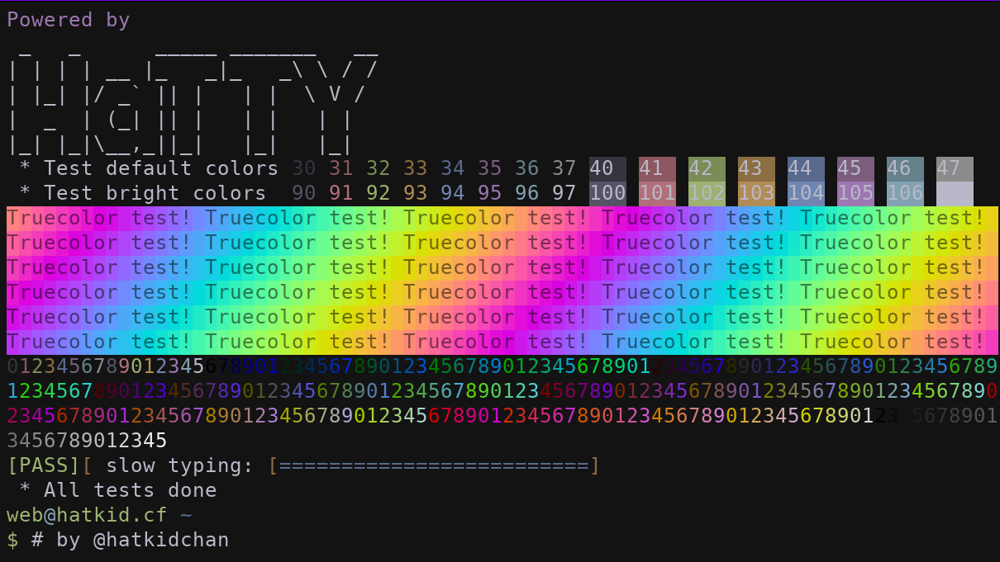

# HaTTY
HaTTY is a simple "terminal emulator" that you can use in your sites.

Implemented features:
 * Terminal palettes
 * 256 colors palette
 * TrueColor support
 * Carriage return
 * Slow connection emulation
 * Wrapping
 * Something like scrolling

Unimplemented features:
 * Proper scrolling
 * Screen buffer
 * Cursor movement
 * Cursor states
 * Line clearing
 * Cursor position requests
 * Keyboard interaction
 * Device status report
 * ... Literally everything else is not implemented ...

Demo screenshot:

